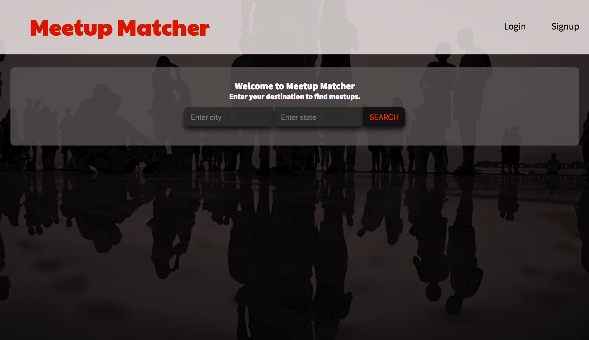
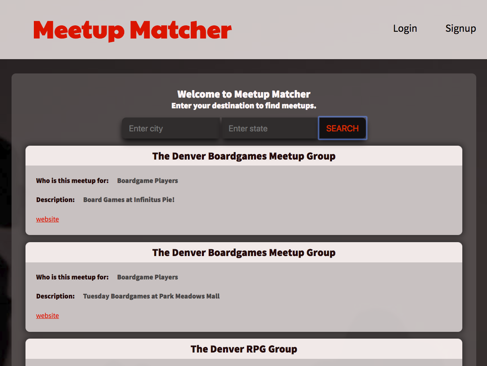
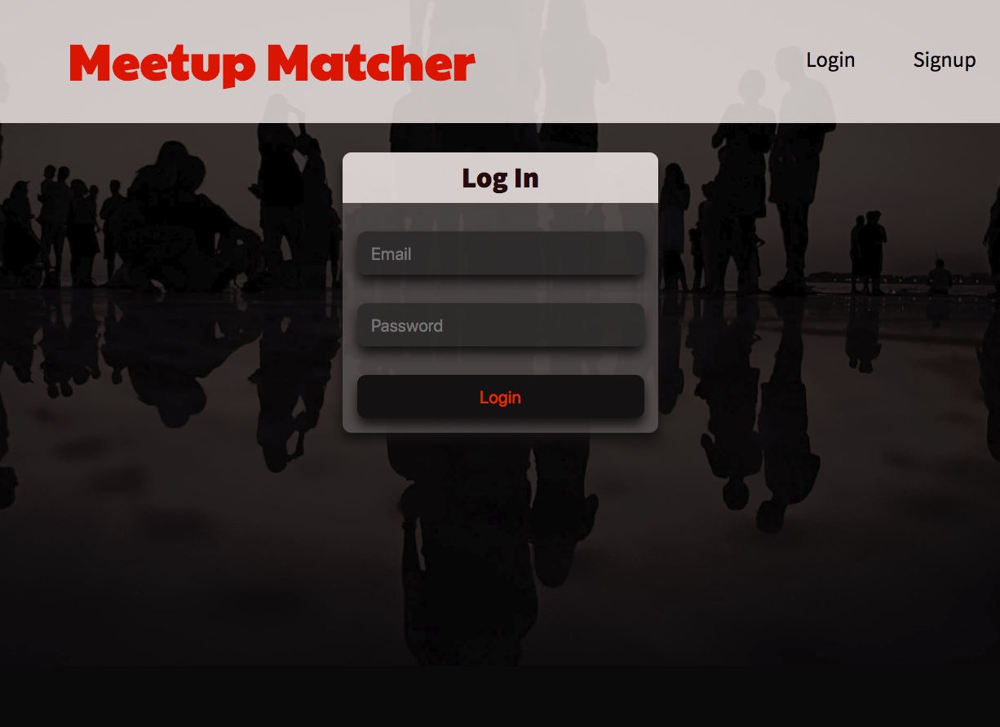

# Meetup Matcher

This project is working off [The Meetup API](https://www.meetup.com/meetup_api/)  
The idea of the project is to be able to sign in as a user and enter a city and state location.  Then recieve a list of meetups for that location based on user preferences.

Using Firebase realtime database as a backend, I set up a separate client-side application using create-react-app.

Created by [Chris Boyen](https://github.com/chrisboylen "Chris Boyen").

## Steps to run App

* $ git clone https://github.com/chrisboylen/meetup-matcher-front.git
* $ cd meetup-matcher-front
* $ npm i
* $ npm start
* $ npm install --save firebase-functions@latest
* $ npm install -g firebase-tools
* $ firebase serve

## Screenshots

  

  

    
